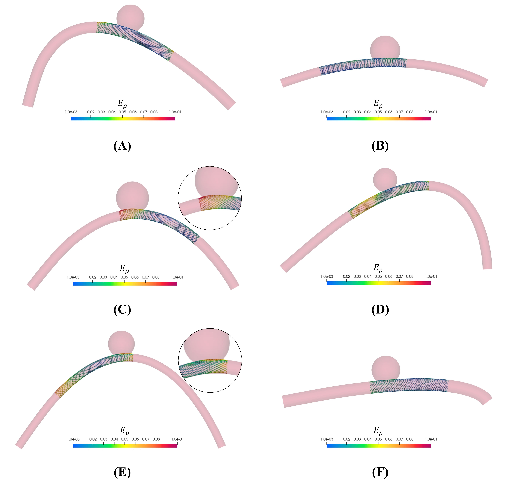

# Machine learning and reduced order modelling for the simulation of braided stent deployment.

Database of FE simulations and Matlab codes to build reduced order models for the prediction of braided stent deployed configurations.

----------------------------

## Abstract
Endoluminal reconstruction using flow diverters represents a novel paradigm for the minimally invasive treatment of intracranial aneurysms. The configuration assumed by these very dense braided stents once deployed within the parent vessel is not easily predictable and medical volumetric images alone may be insufficient to plan the treatment satisfactorily. Therefore, here we propose a fast and accurate machine learning and reduced order modelling framework, based on finite element simulations, to assist practitioners in the planning and interventional stages. It consists of a first classification step to determine a priori whether a simulation will be successful (good conformity between stent and vessel) or not from a clinical perspective, followed by a regression step that provides an approximated solution of the deployed stent configuration. The latter is achieved using a non-intrusive reduced order modelling scheme that combines the proper orthogonal decomposition algorithm and Gaussian process regression. The workflow was validated on an idealized intracranial artery with a saccular aneurysm and the effect of six geometrical and surgical parameters on the outcome of stent deployment was studied. We trained six machine learning models on a dataset of varying size and obtained classifiers with up to 95\% accuracy in predicting the deployment outcome. The support vector machine model outperformed the others when considering a small dataset of 50 training cases, with an accuracy of 93\% and a specificity of 97\%. On the other hand, real-time predictions of the stent deployed configuration were achieved with an average validation error between predicted and high-fidelity results never greater than the spatial resolution of 3D rotational angiography, the imaging technique with the best spatial resolution (0.15 mm). Such accurate predictions can be reached even with a small database of 47 simulations: by increasing the training simulations to 147, the average prediction error is reduced to 0.07 mm. These results are promising as they demonstrate the ability of these techniques to achieve simulations within a few milliseconds while retaining the mechanical realism and predictability of the stent deployed configuration.

----------------------------
## References

1. M. Aguirre and S. Avril, “An implicit 3D corotational formulation for frictional contact dynamics of beams against rigid surfaces using discrete signed distance fields,” Comput. Methods Appl. Mech. Eng., vol. 371, p. 113275, 2020, doi: 10.1016/j.cma.2020.113275.
2. B. Bisighini, M. Aguirre, B. Pierrat, D. Perrin, and S. Avril, “EndoBeams.jl: A Julia finite element package for beam-to-surface contact problems in cardiovascular mechanics,” Adv. Eng. Softw., vol. 171, no. June, 2022, doi: 10.1016/j.advengsoft.2022.103173.
3. B. Bisighini et al., “Machine learning and reduced order modelling for the simulation of braided stent deployment,” Front. Physiol., no. March, pp. 1–18, 2023, doi: 10.3389/fphys.2023.1148540.

For any question, please write to beatrice.bisighini@emse.fr.

